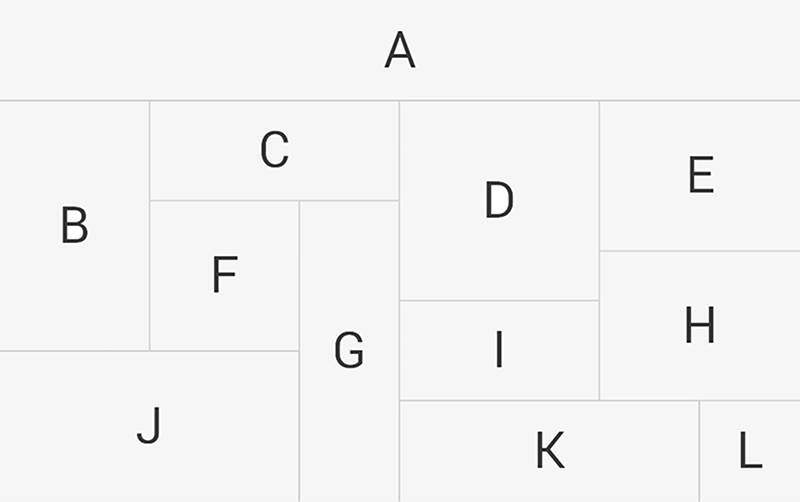
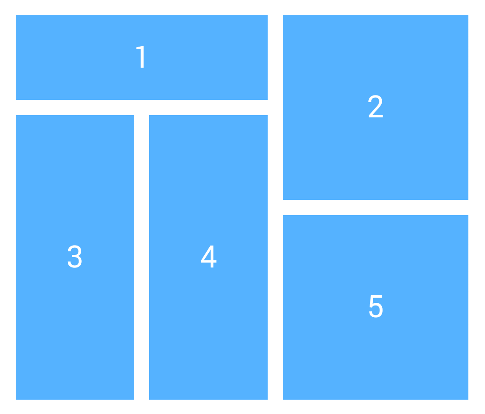
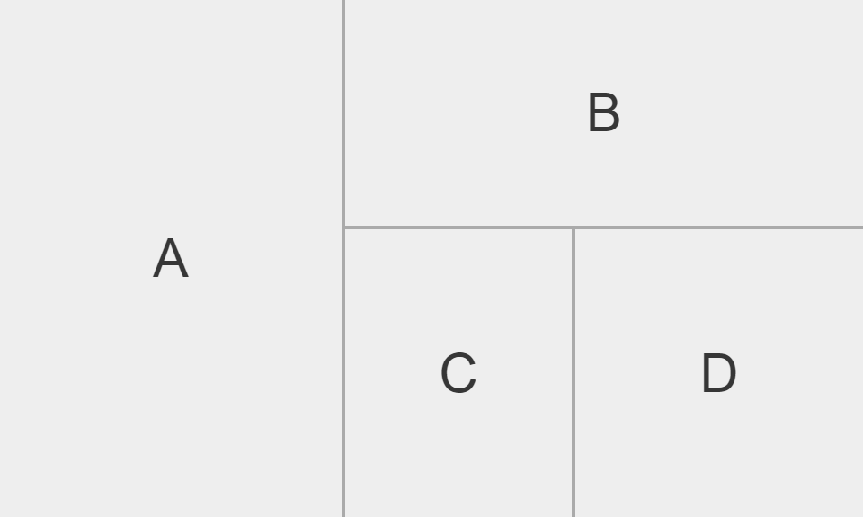
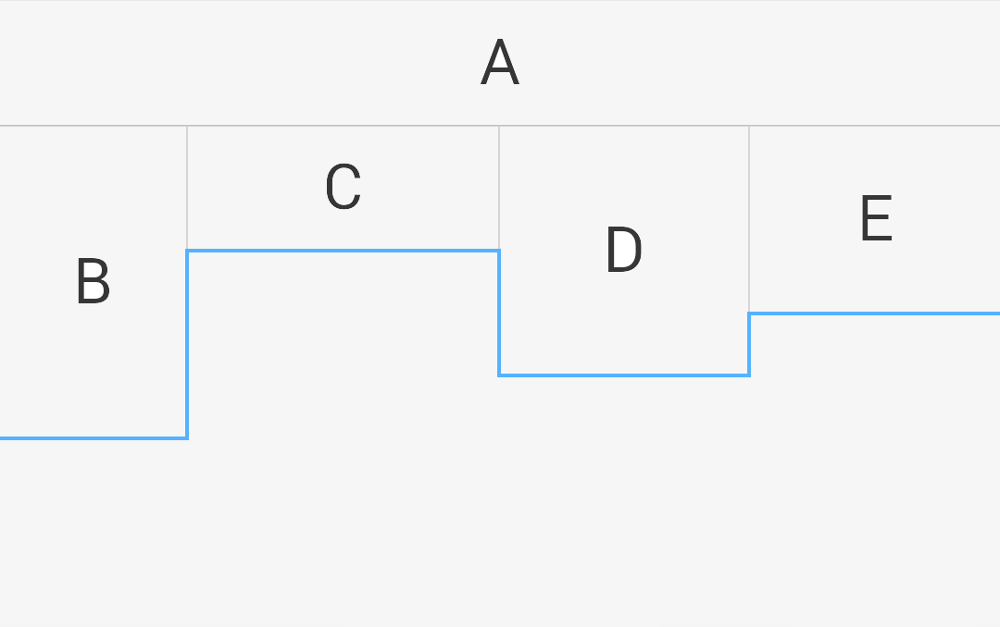
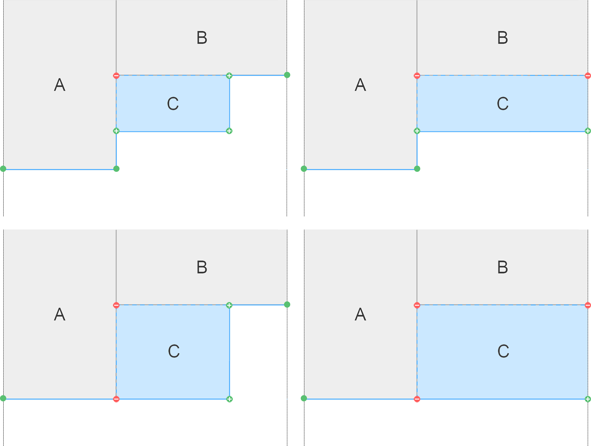

# 实现React网格布局组件
tl;dr


## 网格布局介绍
我所理解的网格布局，就是将一块（矩形）区域，划分成更多更小的（矩形）区域，小区域完全覆盖大区域，没有重叠也没有空隙。

现在有很多网站都使用了网格布局。


尤其是在移动端中。


在常用的布局方法中，如Bootstrap（或其他样式库）的栅格系统、流式布局、多列布局等，都可以简单分为行布局和列布局，然后互相嵌套，实现各种复杂的复杂的效果。

和常规布局方式不同，网格布局并不是线性的布局方法，而是二维的，基于平面的。用常规CSS的方式很难实现，用 `Flex` 只能实现部分类似的功能，但是兼容性不好，规范不统一，各个浏览器（尤其在移动端）有各种奇怪的问题。


最近有一个想法，就是用最近比较流行的 [React](http://facebook.github.io/react/) 框架写一个网格布局组件，纯粹用于布局，不关心组件包含的内容。代码语法也是基于刚正式确立标准的 `ES6` 。


## 理想的实现效果
在 Bootstrap 的栅格系统中，将每行划分成12列，其中的子元素自定义占用多少列。同样，网格布局也应当确定横向和纵向的网格数，子元素定义占用多少行和多少列（宽高），按照某种规则排列。其实在子元素宽高都确定的情况下，网格高度也就确立了，可以自动计算出来。

子元素的宽高虽然是任意的，但是应当满足一个条件：**要确保网格能够被填满，而且不存在重叠部分**。

在满足这个条件的情况下，子元素的划分还可以更复杂一些：


“网格能够被填满”，并不是说网格一定不存在间隙，而是指各个子元素不会因为宽高排列不当而产生的存在块状的空隙。


此外，子元素也可以是一个网格；也就是说，网格是可以嵌套的。


### 简单实例
在明确理想效果之后，先通过一个简单的例子思考如何实现网格布局效果。

希望在 React 组件中只需要这样写：
```html
<Grid col={15}>
    <div col={6} row={9}>A</div>
    <div col={9} row={4}>B</div>
    <div col={4} row={5}>C</div>
    <div col={5} row={5}>D</div>
</Grid>
```
就能得到这样的布局：



## 思考布局方法
普通文档流无法实现这种效果，float 或者 flex 方法也只能实现部分效果；在子元素宽高确定了的情况下，最合适的方式应该就是绝对布局了，也就是使用 `position` 布局。
给 Grid 网格添加 `position: relative;` 样式，每个格子都添加 `position: absolute;` 再保证 `z-index` 不会乱掉，再使用 top 和 left 定位元素位置。

所以关键问题是：**如何确定每个格子的位置**。

### 定位每个格子
首先，需要建立一个坐标系。

以 Grid 左上角为原点，水平向右为 `x` 轴，竖直向下为 `y` 轴。 x 对应 left 值，y对应 top 值。然后，只要确定格子左上角的坐标，就能确认格子摆放的位置，和所占用的区域（默认格子大小是确认的）。

第一个格子很好办，放在(0,0)位置，第二个格子就需要分类讨论了：
 1. 第一个格子刚好排满一行，第二个格子又重新靠左边开始排列。
 2. 第一个格子不满一行，剩下的一行的宽度不够第二个格子排列。*暂时不考虑这种情况，应该从源头上避免！*
 3. 第一个格子不满一行，第二个格子也没排满一行。
 4. 第一个格子不满一行，第二个格子刚好排满一行。

这才只摆到第二个格子而已，还没涉及到高度上的不同。第三个格子、第四个格子需要考虑的情况更多……

第八个格子需要考虑的情况多到难以想象。假如限定每行最多只能摆三个格子，需要考虑的情况会少很多，起码能满足现在大部分移动电商的应用场景了。


但是这种方法费心费力还不好扩展，所以肯定不能用分类讨论的方式确定格子位置。

我是采用 **底部边界线** 方法确定格子位置的。

### 底部边界线定位方法
首先设想一下，当页面已经排好很多格子之后，再摆放下一个格子时的情景。此时并不需要关心之前已经摆好的每个格子都是什么形状，只需要考虑底边一条折线的形状就行了，也就是底部边界线的形状。


**这个形状肯定是一条仅包含直角的折线，下一个格子的左上角顶点肯定会落在这条折线上。**

假设这条折线称为 `边界线`(`boundary`)，左上角顶点成为 `起点`(`origin`) 。
现在的布局问题就分成了两个问题：
 1. 如何在边界线上确认下一个起点？
 2. 在放上一个新格子之后，如何确定边界线的形状？

#### 如何在边界线上确认下一个起点？
基于正常的汉字书写顺序，即“先从左向右，再从上到下”的原则，
对于第一个问题，可以采用一个很简单的思路解决：
**下一个格子的起点应当是边界线最上方的一行中最左边的点。**

根据这个原则很快能写出一个辅助函数，专门来获取边界线中应当是下一个起点的点。

#### 在放上一个新格子之后，如何确定边界线的形状？
这个问题好像有些难，需要考虑多种情况。在放进去一个新格子之后，可能会增加边界线上的点，也可能会减少。

大概有一下几种情况：


但是有一点是可以确定的：**增加/减少的点的位置，肯定在新格子顶点之上。**
而且 **新格子左上角的点肯定会减少，右下角的点肯定会增加。**
了解这两点之后，剩下的两个点也有很大的规律性了：**如果左下角和右上角的点和边界线上的点重合则减少，否则增加。**
这样下来，规律就很明显了。
接下来再想的话，会发现不仅左下角和右上角的点符合上边的规律，其实新格子的四个顶点都符合这个规律！
而且如果把折线都看成点集的话，这其实就是 *集合的异或运算* ，或者称为[集合的对称差](https://zh.wikipedia.org/wiki/%E5%AF%B9%E7%A7%B0%E5%B7%AE) 。

不过，要将折线视为点的集合，需要确认一个问题： *折线中的点是否有序* 。
很可惜在当前情况下是有序的。不过，在确认格子四个顶点之后，格子的形状就是唯一的了，也就是说四个顶点的顺序不影响形状。
同理，如果在点集确定了的情况下，能连成的符合上边描述地边界线的折线，有且仅有一条。
所以，折线中的点虽然有序，但是在当前情况下完全可以忽略顺序，将其视为点集。

也就是说， **求出原边界线线点集和新格子顶点点集的对称差，就是新边界线的点集。**
对于集合的对称差运算，也可以很简单的实现，关键是规范 `点` 和 `点集` 这两个数据结构。


## 编码实现网格布局
好了，思路都已经有了，然后就可以开始写代码了。代码用到了 ES6 的语法。
逆着思考的过程，从后往前写。
### 确定 `点` 和 `点集` 的数据结构。
`点` ，应该仅存在横纵坐标两个属性。此外应该还提供一个判断相等的方法。
为了使用的方便，还定义了一个点偏移后新位置的计算。
```js
class Point {
    // 构造函数，允许提供两个坐标值和一个类Point对象为初始参数
    // 简化了判断方法，未提供错误处理
    constructor(px = 0, py = 0) {
        if (typeof px === 'object') {
            this.x = px.x;
            this.y = px.y;
        } else if (typeof px === 'number') {
            this.x = px;
            this.y = py;
        }
    }

    // 判断两点是否重叠
    isEqualTo(point) {
        return (this.x === point.x) && (this.y === point.y);
    }

    // 将点偏移一个位置，返回新点坐标
    offset(vector = 0, vy = 0) {
        if (typeof vector === 'number') {
            return new Point(this.x + vector, this.y + vy);
        } else if(true) {
            return new Point(this.x + vector.x, this.y + vector.y);
        }
    }
}
```

`点集` 可以使用ES6的 `Set` 或者数组实现。由于目前使用的 babel 不允许类继承内置的 Set 类型，
而且我还想继承数组(或Set)的默认的方法，在其基础上添加其他方法。
因此就采用修改 __proto__ 的方式实现继承。
```js
// 定义“点集”的构造函数，并继承 Array.prototype
function Path(...args) {
    var path = new Array(...args);
    path.__proto__ = Path.prototype;
    return path;
}
Path.prototype = Object.create(Array.prototype);

// 获取最后一个元素
Path.prototype.last = function() {
    return new Point(this[this.length-1]);
};

// 复制点集
Path.prototype.clone = function() {
    return this.map(p => new Point(p));
};

// 计算所排列网格的最大高度（默认格子完全充满网格）
Path.prototype.maxHeight = function() {
    return this.last().y;
};
```

### 实现点集的异或运算
实现的方法是基于求集合对称差公式： `AΔB = (A - B)∪(B - A)` 。
这里的A集合就是this对象本身，运算过程返回新集合，并不直接修改自身集合的元素。
```js
Path.prototype.xor = function(B) {
    // 创建暂存异或结果的新点集
    let _xor = new Path();

    //克隆 B 集合，保证原集合不会被修改
    let B_copy = B.clone();

    this.forEach((pa) => {
        // 判断 B 中是否存在和 A 中相同的元素
        const shared = B.some(pb => pa.isEqualTo(pb));

        if (shared) {
            // 去除 B 副本中的重复元素
            B_copy = B_copy.filter(pb => !pa.isEqualTo(pb));
        } else {
            // 将 A 中不存在于 B 集和的元素加入到异或集合中
            _xor.push(new Point(pa));
        }
    });

    // 将 B 副本中剩余元素并入 xor 集合
    B_copy.forEach(pb => _xor.push(new Point(pb)));

    return _xor;
}
```


### 根据边界线点集确认下一个格子的起点
首先找出 y 坐标（有可能）最小的 minY 的值，也就是最靠上的一条线。
然后在这一行中找到 x 坐标可能出现的最小值，即最左边的点。
```js
function computeOrigin(boundary) {
    let minX = Number.MAX_VALUE;
    let minY = Number.MAX_VALUE;

    boundary.forEach(point => {
        if (point.y < minY) {
            minY = point.y;
            minX = point.x;
        } else if (point.y === minY) {
            minX = (point.x < minX) ? point.x : minX;
        }
    })

    return new Point(minX, minY);
}
```

### 实现计算每个格子布局位置的函数
函数的操作步骤在之前也说的很详细了：
 1. 先初始化边界线，然后依次计算每个格子的顶点位置
 2. 根据格子的形状重新计算边界线

不过这里创建了一个 Path 类型的变量，记录各个格子相应的起点位置。
函数第一个参数是网格的总宽度值，第二个参数是格子长宽值构成的数组

```js
function computePosition(gridWidth, boxes) {

    // 初始化底部边界线
    let boundary = new Path(
        new Point(0, 0),
        new Point(gridWidth, 0)
    );

    // 初始化第一个起点
    let origin = new Point(0, 0);

    // 初始化所有格子的起点记录
    let boxPosition = new Path(new Point(0, 0));

    for(const box of boxes) {
        // 计算当前图形四个顶点的位置
        const rect = new Path(
            origin.offset(0, 0),
            origin.offset(box.x, 0),
            origin.offset(0, box.y),
            origin.offset(box)
        );

        // 重新计算新的 boundary （求两集合的对称差）
        boundary = boundary.xor(rect);

        // 计算下一个起点的位置
        origin = computeOrigin(boundary);

        boxPosition.push(origin);
    }

    return boxPosition;
}
```

到此为止，已经解决网格位置的计算了，下边要做的就是编写 React 组件了。
（待续...）


--
